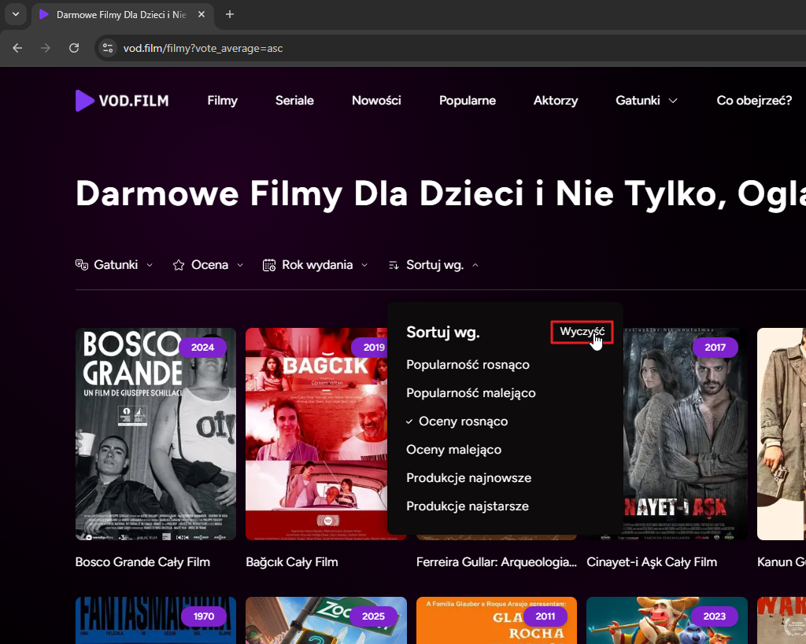
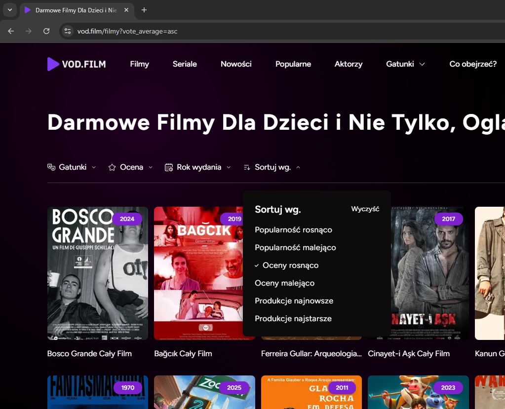
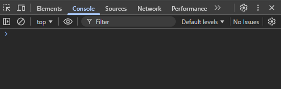
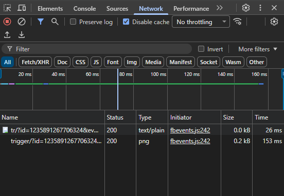

**ID:** BUG-001

**Tytuł:** Przycisk “Wyczyść” nie resetuje sortowania w sekcji “Sortuj wg”.

**Status:** Otwarty/Open

**Środowisko:**

- Strona: https://vod.film/
- Przeglądarka: Chrome 142.0.7444.163, Firefox 145.0.1
- System: Windows 11
- Data testu: 19.11.2025

**Priorytet:** Wysoki/High

**Wpływ:** Duży/Major

**Częstotliwość występowania:** Zawsze

**Opis:** 
Na stronie z filmami [vod.film/filmy](http://vod.film/filmy) po ustawieniu dowolnego sortowania (np. “Oceny rosnąco”) kliknięcie przycisku “Wyczyść” nie usuwa zastosowanego filtra.

**Kroki do reprodukcji:**

1. Otwórz stronę https://vod.film/ 
2. Kliknij przycisk “Filmy”
3. Kliknij przycisk “Sortuj wg.” aby rozwinąć listę.
4. Kliknij “Oceny rosnąco” aby zastosować filtr (lista filmów zmieni kolejność).
5. Kliknij przycisk “Wyczyść”.
6. Obserwuj brak reakcji sortowania na przycisk (ustawiony filtr nie zostaje zresetowany)

**Rezultat oczekiwany (ER):** 

Kliknięcie przycisku “Wyczyść” resetuje ustawione filtry sortowania i wraca do domyślnego wyświetlania listy filmów.

**Rezultat aktualny (AR):**

Kliknięcie przycisku “Wyczyść” nie resetuje sortowania. Widok listy filmów pozostaje na ustawionym filtrze.

**Obserwacje:**

W momencie kliknięcia przycisku “Wyczyść”:

- w konsoli nie pojawiają się żadne błędy
- nie pojawia się żaden request typu FETCH/XHR
- jedyne odnotowane requesty są typu Img

**Załączniki:**

Przed kliknięciem przycisku "Wyczyść":

Po kliknięciu przycisku "Wyczyść":

Konsola po kliknięciu przycisku "Wyczyść":

Zakładka Network po kliknięciu przycisku "Wyczyść":
