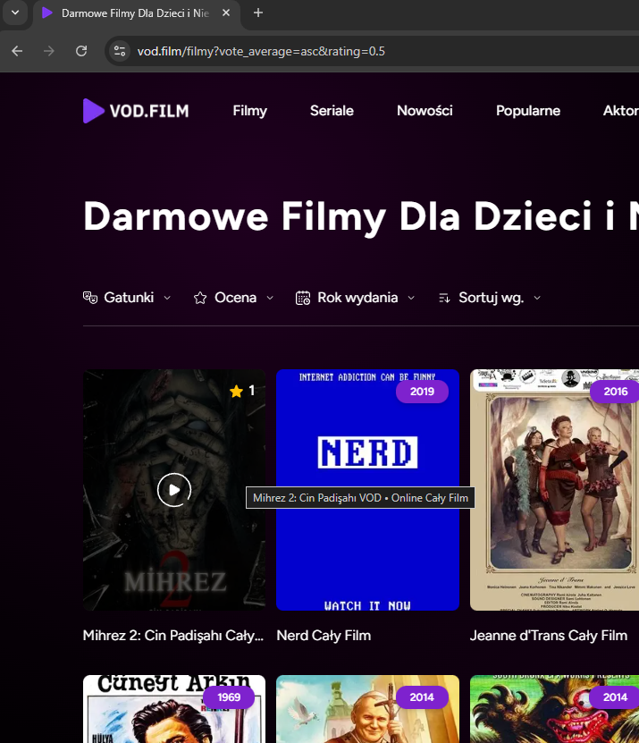
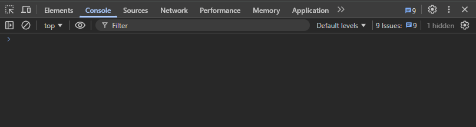
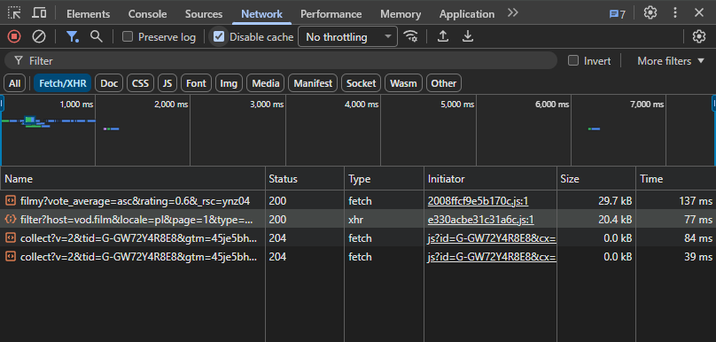

**ID:** BUG-002

**Tytuł:** Filtr Ocena nie działa poprawnie dla wartości 0.6–3.5

**Status:** Otwarty/Open

**Środowisko:** 

- Strona: https://vod.film/
- Przeglądarka: Chrome 142.0.7444.163, Firefox 145.0.1
- System: Windows 11
- Data testu: 19.11.2025

**Priorytet:** Średni/Medium

**Wpływ:** Duży/Major 

**Częstotliwość występowania:** Zawsze

**Opis:** Na stronie z filmami [vod.film/filmy](http://vod.film/filmy) po ustawieniu sortowania “Oceny rosnąco” i zastosowaniu filtra ocen z wartościami w zakresie od 0.6 do 3.5 ( w tym zakresie zauważono nieprawidłowe działanie, możliwe że dla innych wartości również filtr działa nieprawidłowo) filtrowanie działa nieprawidłowo np. dla wartości 0.6 nie pokazuje filmów z oceną poniżej 1.3.

**Kroki do reprodukcji:**

1. Otwórz stronę https://vod.film/ 
2. Kliknij przycisk “Filmy”
3. Kliknij przycisk “Sortuj wg.” aby rozwinąć listę.
4. Kliknij “Oceny rosnąco” aby zastosować filtr (lista filmów zmieni kolejność).
5. Kliknij przycisk “Ocena” aby rozwinąć listę.
6. Ustaw suwak na wartość “0.5”.
7. Najedź kursorem na okładkę pierwszego filmu aby podejrzeć ocenę (pierwszy film ma ocenę 1.0).
8. Kliknij przycisk “Ocena” aby rozwinąć listę.
9. Ustaw suwak na wartość “0.6”.
10. Najedź kursorem na okładkę pierwszego filmu aby podejrzeć ocenę (pierwszy film ma ocenę 1.3).
11. Zaobserwuj różnicę w filtrowaniu ocen dla podanych wartości.

**Rezultat oczekiwany (ER):** 

Po zastosowaniu sortowania wg. oceny rosnąco i zastosowaniu filtra ocen wyświetlana jest lista filmów z oceną od wybranej wartości w górę.

**Rezultat aktualny (AR):**

Po zastosowaniu sortowania wg. oceny rosnąco i zastosowaniu filtra ocen wyświetlana jest lista która pomija filmy, które znajdują się w zakresie ustawionego filtra.

**Obserwacje:**

- Błąd dotyczy ustawień ocen od 0.6 do 3.5 (w tym zakresie zauważono niepoprawne działanie), możliwe że zakresy powyżej również działają niepoprawnie, wymaga dalszej weryfikacji.
- Request XHR: GET /api/filter?host=vod.film&locale=pl&page=1&type=movies&media_type=&genre=&date=2012-2025&country=&sort_rating=asc&sort_date=&sort_popularity=&rating=0.6
- Status odpowiedzi: 200 OK
- Response zawiera filmy z oceną od 1.3 wzwyż
- Brak błędów w konsoli JS

**Załączniki:**

Wyniki sortowania dla wartości "0.5":

Wyniki sortowania dla wartości "0.6":

Konsola w momencie zmiany filtrowania:

Zakładka Network w momencie zmiany filtrowania:

